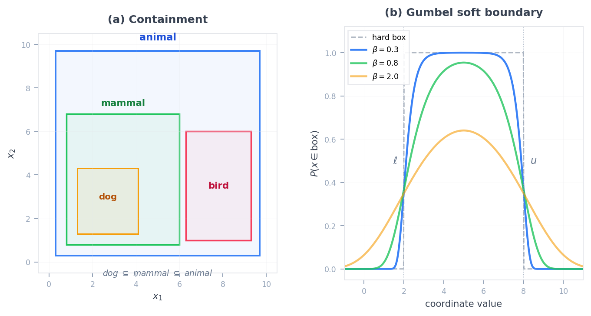
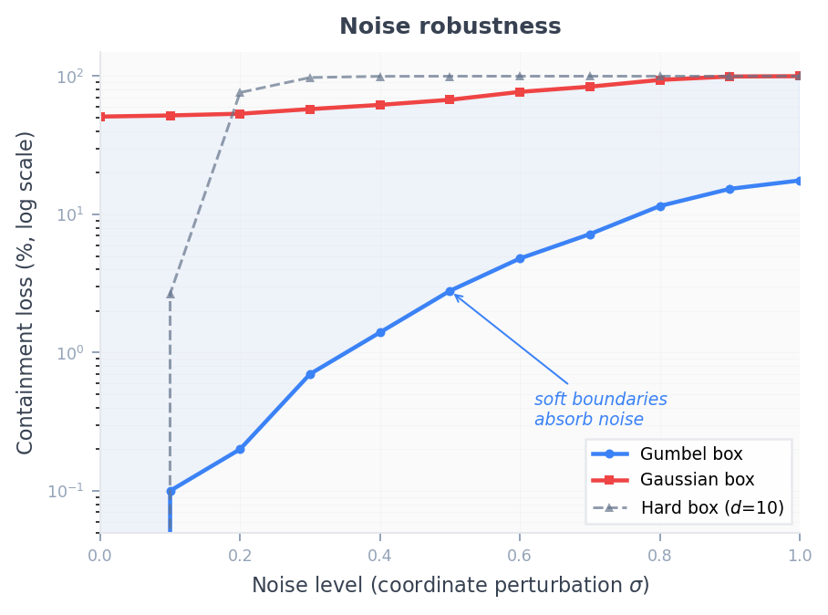
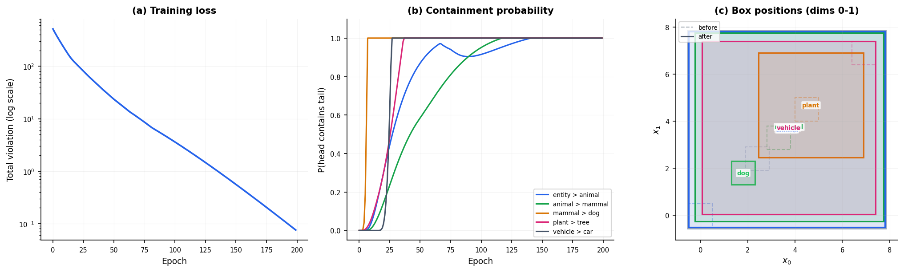

# subsume

[](https://crates.io/crates/subsume)
[](https://docs.rs/subsume)
[](https://github.com/arclabs561/subsume/actions/workflows/ci.yml)

Geometric region embeddings for subsumption, entailment, and logical query answering. Boxes, cones, octagons, Gaussians, hyperbolic intervals, and sheaf networks. Ndarray and Candle backends.



*(a) Containment: nested boxes encode taxonomic is-a relationships. (b) Gumbel soft boundary: temperature controls membership sharpness. (c) Octagon: diagonal constraints cut corners for tighter volume bounds.*

## What it provides

### Geometric primitives

| Component | What it does |
|---|---|
| `Box` trait | Axis-aligned hyperrectangle: volume, containment, overlap, distance |
| `NdarrayGumbelBox` / `CandleGumbelBox` | Probabilistic boxes via Gumbel random variables (dense gradients, no flat regions; Dasgupta et al., 2020) |
| `NdarrayCone` | Angular cones in d-dimensional space: containment via aperture, closed under negation (Zhang & Wang, NeurIPS 2021) |
| `NdarrayOctagon` | Axis-aligned polytopes with diagonal constraints; tighter volume bounds than boxes (Charpenay & Schockaert, IJCAI 2024) |
| `gaussian` | Diagonal Gaussian boxes: KL divergence (asymmetric containment) and Bhattacharyya coefficient (symmetric overlap) |
| `hyperbolic` | Poincare ball embeddings and hyperbolic box intervals (via `hyperball`; requires `hyperbolic` feature) |
| `sheaf` | Sheaf diffusion primitives: stalks, restriction maps, Laplacian (Hansen & Ghrist 2019; Bodnar et al., ICLR 2022) |

### Scoring and query answering

| Component | What it does |
|---|---|
| `distance` | Query2Box alpha-weighted point-to-box distance (Ren et al., 2020); depth-based (RegD) and boundary distances in backend modules |
| `fuzzy` | Fuzzy t-norms/t-conorms for logical query answering (FuzzQE, Chen et al., AAAI 2022) |
| `el` | EL++ ontology embedding: inclusion, intersection (NF1), existential, role chain losses (Box2EL/TransBox) |
| `el_dataset` | EL++ normalized axiom loader (GALEN, Gene Ontology, Anatomy formats) |

### Taxonomy and training

| Component | What it does |
|---|---|
| `taxonomy` | TaxoBell-format dataset loader: `.terms`/`.taxo` parsing, train/val/test splitting |
| `taxobell` | TaxoBell combined loss: Bhattacharyya triplet + KL containment + volume regularization + sigma clipping |
| `BoxEmbeddingTrainer` | CPU trainer with analytical gradients, AMSGrad, Bernoulli negative sampling |
| `CandleBoxTrainer` | GPU trainer with AdamW autograd, cosine LR, self-adversarial NS, inside distance (BoxE-style), volume regularization, filtered evaluation |
| Evaluation | MRR, Hits@k, Mean Rank (filtered, head + tail prediction) |
| `lattix_bridge` | Load ontologies from N-Triples, Turtle, CSV, JSON-LD via [`lattix`](https://crates.io/crates/lattix) (optional) |
| `rankops` | Rank fusion (RRF, CombMNZ), IR evaluation (nDCG, MAP) via [`rankops`](https://crates.io/crates/rankops) (optional) |

### Backends

| Component | What it does |
|---|---|
| `NdarrayBox` / `NdarrayGumbelBox` / `NdarrayCone` / `NdarrayOctagon` | CPU backend using `ndarray::Array1<f32>` |
| `CandleBox` / `CandleGumbelBox` | GPU/Metal backend using `candle_core::Tensor` |
| `CandleBoxTrainer` | GPU training loop: AdamW + autograd, log-sigmoid loss, per-relation translations |

The ndarray backend has full geometry support. The candle backend provides
GPU-accelerated box operations and a complete training loop. Enable with
`features = ["candle-backend"]` or `features = ["cuda"]` for CUDA GPU support.

## Usage

```toml
[dependencies]
subsume = { version = "0.8", features = ["ndarray-backend"] }
ndarray = "0.16"
```

```rust
use subsume::ndarray_backend::NdarrayBox;
// Renamed import avoids shadowing std::boxed::Box
use subsume::Box as BoxRegion;
use ndarray::array;

// Box A: [0,0,0] to [1,1,1] (general concept)
let premise = NdarrayBox::new(array![0., 0., 0.], array![1., 1., 1.], 1.0)?;

// Box B: [0.2,0.2,0.2] to [0.8,0.8,0.8] (specific, inside A)
let hypothesis = NdarrayBox::new(array![0.2, 0.2, 0.2], array![0.8, 0.8, 0.8], 1.0)?;

// Containment probability: P(B inside A)
let p = premise.containment_prob(&hypothesis)?;
assert!(p > 0.9);
```

### Training (Rust)

```rust,ignore
use subsume::{BoxEmbeddingTrainer, TrainingConfig, Dataset};
use subsume::dataset::load_dataset;
use std::path::Path;

let dataset = load_dataset(Path::new("data/wn18rr"))?;
let interned = dataset.into_interned();
let train: Vec<_> = interned.train.iter().map(|t| (t.head, t.relation, t.tail)).collect();

let config = TrainingConfig { learning_rate: 0.01, epochs: 50, ..Default::default() };
let mut trainer = BoxEmbeddingTrainer::new(config, 32);
let result = trainer.fit(&train, None, None)?;
println!("MRR: {:.3}", result.final_results.mrr);
```

### Training (GPU via candle)

```rust,ignore
use subsume::CandleBoxTrainer;
use candle_core::Device;

let device = Device::cuda_if_available(0).unwrap_or(Device::Cpu);
let trainer = CandleBoxTrainer::new(num_entities, num_relations, 200, 10.0, &device)?
    .with_inside_weight(0.02)   // BoxE-style center attraction
    .with_vol_reg(0.0001);      // prevent trivial solution

let losses = trainer.fit(&train_triples, 500, 0.001, 512, 9.0, 128, 1.0)?;
let (mrr, h1, h3, h10, mr) = trainer.evaluate(&test_triples, &all_triples)?;
```

### Training (Python)

```bash
pip install subsumer
```

```python
import subsumer

triples = [("animal", "hypernym", "dog"), ("animal", "hypernym", "cat"), ...]
config = subsumer.TrainingConfig(dim=32, epochs=50, learning_rate=0.01)
trainer, ids = subsumer.BoxEmbeddingTrainer.from_triples(triples, config=config)
result = trainer.fit(ids)
print(f"MRR: {result['mrr']:.3f}")
```

Triple convention: head box **contains** tail box. For datasets where triples
are `(child, hypernym, parent)`, pass `reverse=True` to `from_triples` or
`load_dataset`.

## Examples

```bash
cargo run -p subsume --example containment_hierarchy    # taxonomic is-a relationships with nested boxes
cargo run -p subsume --example gumbel_box_exploration   # Gumbel boxes, soft containment, temperature effects
cargo run -p subsume --example cone_training            # training cone embeddings on a taxonomy
cargo run -p subsume --example box_training             # training box embeddings on a 25-entity taxonomy
cargo run -p subsume --example taxobell_demo            # TaxoBell Gaussian box losses on a mini taxonomy
cargo run -p subsume --example query2box                # Query2Box: multi-hop queries, box intersection, distance scoring
cargo run -p subsume --example octagon_demo             # octagon embeddings: diagonal constraints, containment, volume
cargo run -p subsume --example fuzzy_query              # fuzzy query answering: t-norms, De Morgan duality, rankings
cargo run -p subsume --example dataset_training --release # full pipeline: WN18RR-format data, train, evaluate
cargo run -p subsume --example imagenet_hierarchy --release # 252 Tiny ImageNet synsets, volume-depth correlation
cargo run -p subsume --example save_checkpoint --release           # generate pretrained/wordnet_subset.json checkpoint
cargo run -p subsume --features hyperbolic --example hyperbolic_demo  # Poincare ball: hierarchy preservation, exponential capacity
cargo run -p subsume --example wn18rr_training --release  # WN18RR benchmark: 40K entities, 20 epochs
cargo run -p subsume --example el_training              # EL++ box embeddings on a biomedical-style ontology
cargo run -p subsume --example gene_ontology --release  # Gene Ontology EL++ axioms: NF1-NF4, subsumption inference
cargo run -p subsume --example cone_query_answering     # FOL queries with cones: AND, OR, NOT, projection
cargo run -p subsume --features candle-backend --example taxobell_training  # TaxoBell MLP encoder training (Candle)
cargo run -p subsume --features candle-backend --example wn18rr_candle --release  # WN18RR GPU training + filtered eval
```

See [`examples/README.md`](examples/README.md) for a guide to choosing the right example.

## Tests

```bash
cargo test -p subsume
```

Unit, property, and doc tests covering:

- Box geometry: intersection, union, containment, overlap, distance, volume, truncation
- Gumbel boxes: membership probability, temperature edge cases, Bessel volume
- Cones: angular containment, negation closure, aperture bounds
- Octagon: intersection closure, containment, Sutherland-Hodgman volume
- Fuzzy: t-norm/t-conorm commutativity, associativity, De Morgan duality
- Gaussian boxes, EL++ ontology losses, sheaf networks, hyperbolic geometry
- Training: MRR, Hits@k, Mean Rank, negative sampling (uniform, Bernoulli), AMSGrad

## Choosing a geometry

| Geometry | When to use it | ¬? | Key tradeoff |
|---|---|---|---|
| NdarrayBox / NdarrayGumbelBox | Containment hierarchies, each dimension independent | No | Simple, fast; Gumbel adds dense gradients where hard boxes have zero gradient |
| Cone | Multi-hop queries requiring negation (FOL with ¬) | Yes | Closed under complement; angular parameterization harder to initialize |
| Octagon | Rule-aware KG completion; tighter containment than boxes | No | Diagonal constraints cut box corners; more parameters per entity |
| Gaussian | Taxonomy expansion with uncertainty (TaxoBell) | No | KL = asymmetric containment; Bhattacharyya = symmetric overlap |
| Hyperbolic | Tree-like hierarchies with exponential branching | No | Low-dim capacity; numerical care near Poincare ball boundary |

## Why regions instead of points?

Point embeddings (TransE, RotatE, ComplEx) represent entities as vectors. They work
well for link prediction -- RotatE hits 0.476 MRR on WN18RR, BoxE hits 0.451.
For standard triple scoring, points are simpler and equally accurate.

Regions become necessary when the task requires structure that points cannot encode.
The core operation is **containment probability**:

$$P(B \subseteq A) = \frac{\text{Vol}(A \cap B)}{\text{Vol}(B)}$$

If B fits inside A, $P = 1$. If disjoint, $P = 0$. This is the scoring
function used for evaluation (`containment_prob`).

| What you need | Points | Regions |
|---|---|---|
| Containment (A ⊆ B) | No -- points have no interior | Box nesting = subsumption |
| Volume = generality | No -- points have no size | Large box = broad concept |
| Intersection (A ∧ B) | No set operations | Box ∩ Box = another box |
| Negation (¬A) | No complement | Cone complement = another cone |
| Uncertainty per dimension | No | Gaussian sigma |

Three tasks where point embeddings structurally fail:

1. **Ontology completion (EL++)**: "Dog is-a Animal" requires representing one concept's
   extension as a subset of another's. Points have no containment. Box2EL, TransBox, and
   DELE use boxes for this and outperform point baselines on Gene Ontology, GALEN, and
   Anatomy.

2. **Logical query answering (∧, ∨, ¬)**: multi-hop KG queries with conjunction,
   disjunction, and negation need set operations. ConE handles all three (MRR 52.9 on
   FB15k EPFO+negation queries vs Query2Box's 41.0 and BetaE's 44.6). Points cannot
   attempt negation queries at all.

3. **Taxonomy expansion**: inserting a new concept at the right depth requires knowing
   both what it is (similarity) and how general it is (volume). TaxoBell uses Gaussian
   boxes where KL divergence gives asymmetric parent-child containment for free.

If your task is link prediction or entity similarity, use RotatE. If you need
containment, set operations, or volume, you need regions.

See [`docs/SUBSUMPTION_HISTORY.md`](docs/SUBSUMPTION_HISTORY.md) for the research
history of geometric subsumption embeddings, from hard boxes through Gumbel, cones, and beyond.

## Why Gumbel boxes?



*(a) Membership probability at a box boundary: hard boxes have a discontinuous step, Gumbel boxes have smooth sigmoids controlled by temperature. (b) Gradient magnitude: hard boxes produce zero gradient everywhere except the exact boundary (gray regions), while Gumbel boxes provide gradients throughout the space.*

Gumbel boxes model coordinates as Gumbel random variables, creating soft boundaries
that provide dense gradients throughout training. Hard boxes create flat regions where
gradients vanish; Gumbel boxes solve this *local identifiability problem*
(Dasgupta et al., 2020). Lower temperature (small beta) gives crisper boundaries with
sharper gradients; higher temperature gives broader gradients that reach further from
the boundary but sacrifice containment precision.

## Training convergence



*25-entity taxonomy learned over 200 epochs. Left: total violation drops 3 orders of magnitude. Right: containment probabilities converge to 1.0 at different rates depending on hierarchy depth. Reproduce: `cargo run --example box_training` or `uv run scripts/plot_training.py`.*

## Embedding export

`BoxEmbeddingTrainer::export_embeddings()` returns flat f32 vectors suitable for
safetensors, numpy (via reshape), and vector databases:

```rust,ignore
let (ids, mins, maxs) = trainer.export_embeddings();
// mins/maxs are flat Vec<f32> of length n_entities * dim
// Reshape to (n_entities, dim) for numpy/safetensors
```

Checkpoint save/load via serde:

```rust,ignore
let json = serde_json::to_string(&trainer)?;
let restored: BoxEmbeddingTrainer = serde_json::from_str(&json)?;
```

## Integration patterns

Convert from petgraph (when `petgraph` feature is enabled):

```rust,ignore
use subsume::petgraph_adapter::from_graph;
let dataset = from_graph(&my_digraph);
```

Convert from polars (no dependency needed, user-side code):

```rust,ignore
use subsume::dataset::Triple;
let triples: Vec<Triple> = df.column("head")?.str()?
    .into_iter()
    .zip(df.column("relation")?.str()?)
    .zip(df.column("tail")?.str()?)
    .filter_map(|((h, r), t)| Some(Triple::new(h?, r?, t?)))
    .collect();
let dataset = Dataset::new(triples, vec![], vec![]);
```

## EL++ ontology completion benchmarks

Per-normal-form results on Box2EL benchmark datasets (Jackermeier et al., 2023),
evaluated by center L2 distance ranking (matching Box2EL protocol).
Bold marks the best H@1 for each (dataset, NF) pair.

| Dataset | NF type | subsume H@1 | subsume H@10 | Box2EL H@1 | Box2EL H@10 |
|---|---|---|---|---|---|
| GALEN (23K) | NF1: C1 ⊓ C2 ⊑ D | **0.047** | 0.125 | 0.03 | 0.30 |
| GALEN | NF2: C ⊑ D | 0.052 | **0.357** | **0.06** | 0.15 |
| GALEN | NF3: C ⊑ ∃r.D | **0.208** | **0.456** | 0.08 | 0.19 |
| GALEN | NF4: ∃r.C ⊑ D | 0.001 | 0.001 | 0.00 | 0.06 |
| GO (46K) | NF1 | **0.143** | **0.401** | 0.03 | 0.17 |
| GO | NF2 | 0.033 | 0.230 | **0.18** | **0.58** |
| GO | NF3 | **0.260** | **0.514** | 0.00 | 0.18 |
| GO | NF4 | 0.000 | 0.082 | 0.00 | **0.37** |
| ANATOMY (106K) | NF1 | **0.194** | **0.422** | 0.07 | 0.34 |
| ANATOMY | NF2 | 0.065 | 0.237 | **0.16** | **0.41** |
| ANATOMY | NF3 | 0.155 | 0.313 | **0.21** | **0.56** |
| ANATOMY | NF4 | 0.000 | 0.000 | 0.00 | 0.05 |

subsume wins NF1 (conjunction) and NF3 (existential) on GALEN and GO.
Box2EL wins NF2 (atomic subsumption) on GO and ANATOMY.
NF4 (inverse existential) is near-zero for both methods across all datasets.
Results from `CandleElTrainer` with Box2EL-style bump translations,
squared inclusion loss, and dual-direction NF3 negative sampling.

Reproduce: `BACKEND=candle cargo run --features candle-backend --example el_benchmark --release -- data/GALEN`

## GPU training

The `CandleBoxTrainer` supports CPU, CUDA, and Metal via the candle backend:

```bash
# CPU
cargo run --features candle-backend --example wn18rr_candle --release

# CUDA GPU
cargo run --features cuda --example wn18rr_candle --release
```

Configure via environment variables:

```bash
DIM=200 EPOCHS=500 LR=0.001 NEG=128 BATCH=512 MARGIN=9.0 \
  ADV_TEMP=1.0 INSIDE_W=0.02 VOL_REG=0.0001 BOUNDS_EVERY=50 \
  cargo run --features cuda --example wn18rr_candle --release
```

See `examples/README.md` for all available examples.

## References

- Nickel & Kiela (2017). "Poincare Embeddings for Learning Hierarchical Representations"
- Vilnis et al. (2018). "Probabilistic Embedding of Knowledge Graphs with Box Lattice Measures"
- Li et al. (2019). "Smoothing the Geometry of Probabilistic Box Embeddings" (ICLR 2019)
- Sun et al. (2019). "RotatE: Knowledge Graph Embedding by Relational Rotation in Complex Space" (self-adversarial negative sampling)
- Abboud et al. (2020). "BoxE: A Box Embedding Model for Knowledge Base Completion"
- Dasgupta et al. (2020). "Improving Local Identifiability in Probabilistic Box Embeddings"
- Ren et al. (2020). "Query2Box: Reasoning over Knowledge Graphs using Box Embeddings"
- Hansen & Ghrist (2019). "Toward a Spectral Theory of Cellular Sheaves"
- Bodnar et al. (2022). "Neural Sheaf Diffusion: A Topological Perspective on Heterophily and Oversmoothing in GNNs"
- Boratko et al. (2021). "Box Embeddings: An open-source library for representation learning using geometric structures" (EMNLP Demo)
- Chen et al. (2021). "Probabilistic Box Embeddings for Uncertain Knowledge Graph Reasoning" (BEUrRE, ACL 2021)
- Gebhart, Hansen & Schrater (2021). "Knowledge Sheaves: A Sheaf-Theoretic Framework for Knowledge Graph Embedding"
- Zhang & Wang (2021). "ConE: Cone Embeddings for Multi-Hop Reasoning over Knowledge Graphs"
- Chen et al. (2022). "Fuzzy Logic Based Logical Query Answering on Knowledge Graphs"
- Jackermeier et al. (2023). "Dual Box Embeddings for the Description Logic EL++"
- Yang, Chen & Sattler (2024). "TransBox: EL++-closed Ontology Embedding"
- Bourgaux et al. (2024). "Knowledge Base Embeddings: Semantics and Theoretical Properties" (KR 2024)
- Charpenay & Schockaert (2024). "Capturing Knowledge Graphs and Rules with Octagon Embeddings"
- Lacerda et al. (2024). "Strong Faithfulness for ELH Ontology Embeddings" (TGDK 2024)
- Huang et al. (2023). "Concept2Box: Joint Geometric Embeddings for Learning Two-View Knowledge Graphs"
- Mashkova et al. (2024). "DELE: Deductive EL++ Embeddings for Knowledge Base Completion"
- Yang & Chen (2025). "Achieving Hyperbolic-Like Expressiveness with Arbitrary Euclidean Regions"
- Mishra et al. (2026). "TaxoBell: Gaussian Box Embeddings for Self-Supervised Taxonomy Expansion" (WWW '26)

## See also

- [`hyperball`](https://crates.io/crates/hyperball) -- hyperbolic geometry primitives (optional; requires `hyperbolic` feature for Poincare ball embeddings)

## License

MIT OR Apache-2.0
