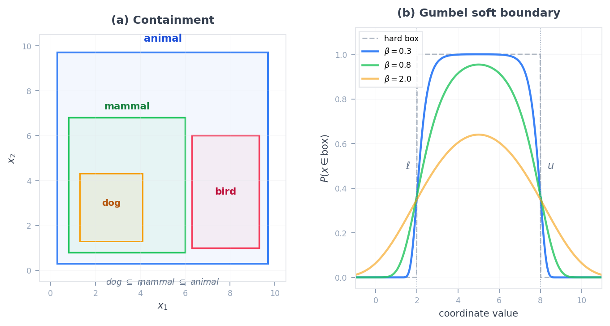

# subsume

[](https://crates.io/crates/subsume)
[](https://docs.rs/subsume)

Region embeddings for entailment and set containment.

`subsume` represents concepts as geometric regions. A general concept contains
the regions for its more specific concepts. It scores containment for
hierarchies, ontologies, and set queries.



Nested boxes encode an `is-a` relationship. The right panel shows how Gumbel
boxes replace a hard boundary with a temperature-controlled one.

## Install

```toml
[dependencies]
subsume = "0.17.1"
ndarray = "0.16"
```

The default features include the ndarray backend and knowledge-graph dataset
helpers. Burn training examples require `burn-ndarray` for CPU or `burn-wgpu`
for a WGPU device.

## Usage

```rust
use ndarray::array;
use subsume::{ndarray_backend::NdarrayBox, BoxError, HyperBox};

fn main() -> Result<(), BoxError> {
    // `general` contains `specific`.
    let general = NdarrayBox::new(array![0., 0., 0.], array![1., 1., 1.], 1.0)?;
    let specific = NdarrayBox::new(array![0.2, 0.2, 0.2], array![0.8, 0.8, 0.8], 1.0)?;

    let probability = general.containment_prob(&specific)?;
    println!("P(specific in general) = {probability:.1}");
    Ok(())
}
```

```text
P(specific in general) = 1.0
```

For hard boxes, this is the fraction of the specific box's volume that lies in
the general box. It is a geometric score, not calibrated probability for an
observed label. The triple convention is `head contains tail`; reverse datasets
that instead store `(child, hypernym, parent)`.

## Choose a geometry

| Task | Start with | Notes |
| --- | --- | --- |
| Containment hierarchy | `NdarrayBox` or `NdarrayGumbelBox` | Boxes have volume and intersection; Gumbel boxes give dense gradients |
| Logical queries with negation | Cone or subspace | Cones and subspaces support complement-like operations |
| Taxonomy expansion with distributional spread | Gaussian boxes | KL gives asymmetric containment; Bhattacharyya gives overlap |
| EL++ ontology completion | `el`, `transbox` | Uses axiom losses rather than plain triple scoring |
| Tree-like hierarchies in low dimension | Hyperbolic intervals or balls | Useful when depth is the main structure |

The full geometry table is in [`docs/geometries.md`](docs/geometries.md).
Scores are meaningful within one geometry, but are not calibrated across
geometries. See `cargo run --example region_generic`.

## Examples

```bash
cargo run --example containment_hierarchy
```

This self-contained example prints containment and overlap scores for a small
hierarchy. The [example guide](examples/README.md) covers training, ontology,
query, and data-gated benchmarks.

Python bindings are published as `subsumer`; see
[`subsume-python/README.md`](subsume-python/README.md).

## Benchmarks

EL++ ontology completion results and reproduction commands are in
[`docs/benchmarks.md`](docs/benchmarks.md). The current strongest results are on
NF3 existential restrictions, with MRR 0.21-0.37 across GALEN, GO, and Anatomy in
recorded single-run Burn runs.

## Limits

- For ordinary link prediction, point embeddings are often simpler.
- Region scores from different geometries are not directly comparable.
- Region volume expresses geometric generality; it is not calibrated epistemic
  or target uncertainty. Gaussian geometry represents distributional spread,
  with assumptions set by the caller.
- Several geometry trainers are research paths, not recommended defaults.
- GPU examples depend on Burn backend features and dataset files under `data/`.

## Documentation

- [Geometry table](docs/geometries.md)
- [EL++ benchmarks](docs/benchmarks.md)
- [CLQA evaluation](docs/CLQA_EVAL.md)
- [Research history](docs/SUBSUMPTION_HISTORY.md)
- [Python bindings](subsume-python/README.md)

## License

MIT OR Apache-2.0
